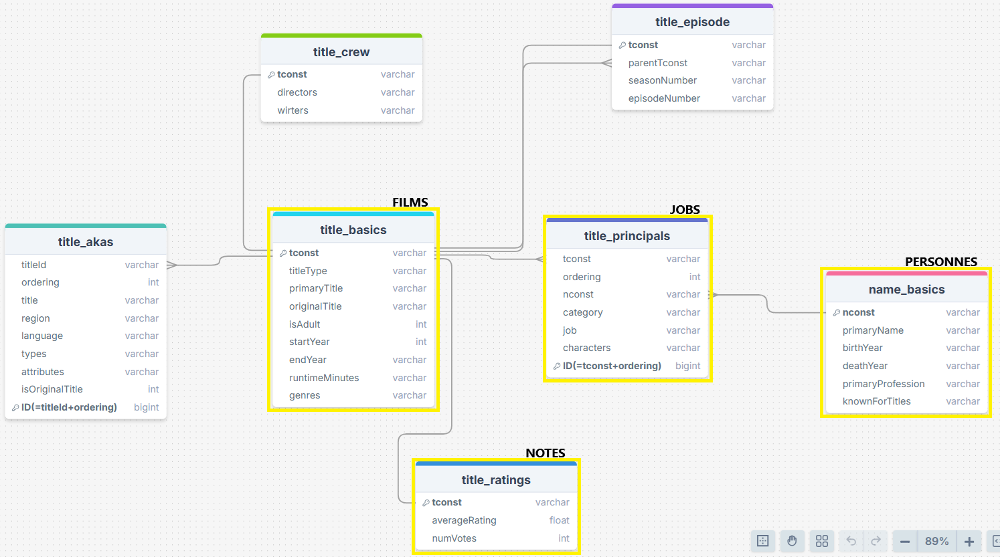
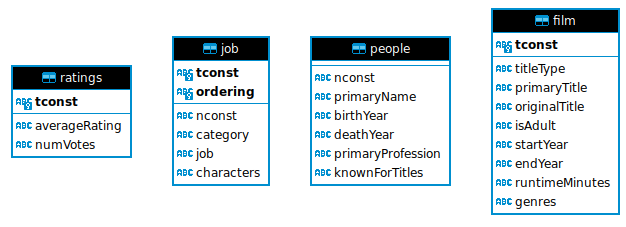

# Projet-Netfloox-G1

## BDD 
Script SQL création des tables : `CreationSQL.sql` 
Structure complète :

Structure dans schéma 'test'


### remplissage des données
Script DataBaseCreation.py : remplissage (filmInfo,jobInfo,ratingsInfo,peopleInfo)

## Application

### Installation

Installation env:
```bash
 python3 -m venv venv
 source venv/bin/activate
 pip install -r requirements.txt
 #pip freeze
```

Environnement :  
Un fichier .env doit être fourni.  
Voir .env.template (à remplir)

### Appli Streamlit

app.py, pages_*.py : appli streamlit (port 8501)
```bash
 streamlit run app.py
```